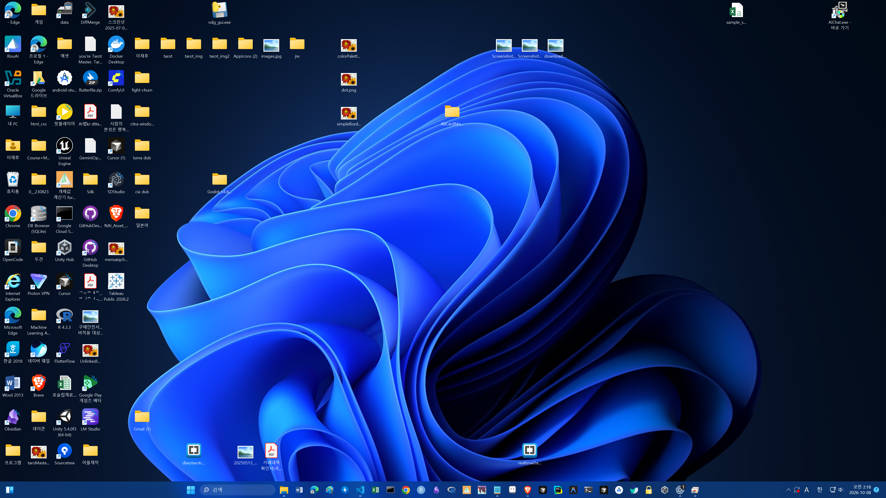
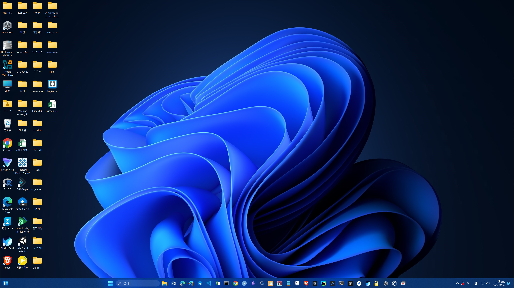
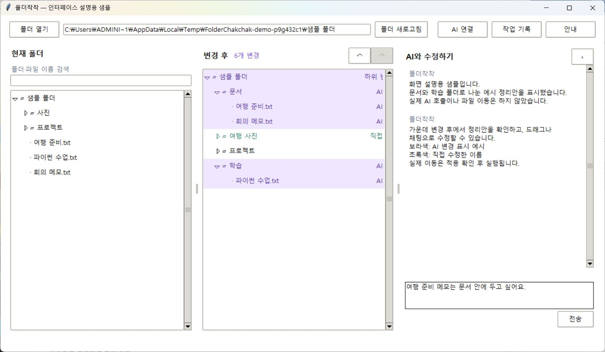

# 폴더착착

폴더와 파일을 살펴보고 **정리안을 미리 확인한 뒤 적용하는 Windows 데스크톱 프로그램**입니다. AI 조사·채팅과 드래그 편집을 함께 사용할 수 있습니다.

선택한 실제 폴더를 정리합니다. AI는 정리안을 만들며 파일의 실제 이동은 사용자의 적용 확인 뒤에만 실행됩니다. 별도 작업 복사본을 만들지 않습니다.

## Windows 프로그램 다운로드

**[폴더착착 v0.1.4 다운로드 (Windows x64 ZIP)](https://github.com/LeeJaeHu/workspace-organizer/releases/download/v0.1.4/FolderChakchak-v0.1.4-windows-x64.zip)** · [릴리즈 안내](https://github.com/LeeJaeHu/workspace-organizer/releases/tag/v0.1.4)

Python 설치나 명령어 입력 없이 사용할 수 있습니다.

1. 위 ZIP을 내려받고 **압축을 모두 풀어** 주세요.
2. 압축을 푼 `FolderChakchak` 폴더에서 **FolderChakchak.exe**를 실행하세요. `_internal` 폴더를 함께 보관해야 합니다.
3. **폴더 열기**에서 정리할 폴더를 선택하세요.
4. 선택한 폴더가 바로 열립니다. **변경 후**에서 정리안을 확인하세요. 적용 버튼을 누르기 전에는 자료를 이동하지 않습니다.
5. AI를 쓰려면 **AI 연결**에 키를 입력하고 채팅을 전송하세요. 실제 이동은 정리안 검토 후 적용합니다.

Windows x64 시험판이며 Windows 11에서 실행을 확인했습니다. 코드 서명 인증서는 적용하지 않아 Windows가 게시자를 확인할 수 없다는 경고를 표시할 수 있습니다. 공식 저장소의 릴리즈와 SHA-256을 확인하세요. Git 프로젝트 검사는 별도 Git 설치가 필요할 수 있습니다. AI 사용료는 별도입니다.

## 정리 적용 전후

사용자가 제공한 실제 바탕화면 정리 적용 전후 사진입니다. 적용 후에는 개발·학습, 문서, 이미지, 설치파일 등의 폴더로 모인 모습을 볼 수 있습니다. 사진을 누르면 원본 크기로 볼 수 있습니다.

| 적용 전 | 적용 후 |
| --- | --- |
| [](docs/images/desktop-before.png) | [](docs/images/desktop-after.png) |

## 프로그램 화면과 사용 흐름

[](docs/images/interface.jpg)

실제 프로그램을 샘플 폴더로 실행해 캡처한 화면입니다. 정리안·채팅은 화면 설명용 예시이며 실제 AI 응답이나 사용자 자료가 아닙니다. 화면의 파일 이동은 아직 적용하지 않은 상태입니다.

| 화면 영역 | 사용하는 방법 |
| --- | --- |
| 상단 폴더 주소와 도구 | **폴더 열기**로 정리할 위치를 고르고 **폴더 새로고침**으로 디스크의 최신 상태를 불러옵니다. **AI 연결**에서 OpenAI 키·모델·예산을 설정합니다. |
| 왼쪽 · 현재 폴더 | 실제 폴더 구조를 펼쳐 봅니다. 이름을 검색하면 일치 항목과 상위 경로를 확인할 수 있습니다. |
| 가운데 · 변경 후 | 적용할 정리안을 미리 보고 마우스로 옮겨 수정합니다. 보라색은 AI 변경, 초록색은 직접 수정한 항목입니다. 우클릭으로 이름 변경·새 폴더·메모를 사용할 수 있습니다. |
| 오른쪽 · AI와 수정하기 | 정리 요청이나 수정할 내용을 적고 **전송**합니다. 조사 결과, 제한 이유, 승인 요청도 이곳에서 확인합니다. |
| 작업 기록 | 실제로 적용한 이동 내역을 확인하고, 조건이 맞으면 되돌립니다. 가운데의 되돌리기 화살표는 미적용 정리안을 편집하는 기능입니다. |

1. **현재 폴더**에서 구조를 확인합니다. 이름 검색은 접힌 하위 폴더도 찾고 일치 항목과 상위 경로를 표시합니다.
2. **AI 연결**에서 OpenAI 모델·메시지당 예산을 선택하고 키를 입력합니다.
3. 채팅에 정리 방법을 적고 **전송**하면 AI가 목록과 필요한 본문을 조사해 정리안을 만듭니다. 수동 편집은 키 없이도 가능합니다.
4. **변경 후**에서 드래그로 이동하고, 우클릭으로 이름 변경·새 폴더·메모를 사용할 수 있습니다. 채팅으로도 수정할 수 있습니다.
5. **이 정리안 적용…**을 누르거나 `적용해줘`라고 입력합니다. 검사 결과와 이동 목록을 확인한 뒤 적용 버튼을 눌러야 실제 파일이 바뀝니다.
6. 실제 이동은 **작업 기록**에서 확인하고 조건이 맞으면 되돌릴 수 있습니다.

일부 제안이 프로젝트 경계·충돌 등의 검사에 막히면 AI가 항목별 이유와 대안을 받아 다시 검토합니다. 대안을 만들지 못하더라도 이미 초안 검사에 통과한 변경은 보존하고 제외한 항목과 다음 행동을 안내합니다. 실제 적용 전에는 별도로 내용·Git 검사를 합니다. 선택 범위 전체가 프로젝트 내부이면 상위 폴더를 다시 선택해야 할 수 있습니다.

**변경 후 화면은 실제 디스크가 아니라 미적용 정리안을 포함한 예상 구조입니다.** 일부 작업이 보류되면 적용 완료 안내와 함께 남은 변경 수를 표시합니다.

- AI 변경은 보라색, 직접 수정은 초록색으로 표시합니다. 변경 항목의 상위 폴더도 보라색으로 표시하며, 직접 바뀌지 않은 상위 폴더에는 **하위 변경**이 표시됩니다. 이동 전·후 양쪽 상위 폴더에 적용됩니다.
- 초안의 되돌리기·다시 실행은 실제 파일 이동을 취소하는 기능과 별개입니다.
- 폴더·파일 메모는 우클릭으로 작성하고 이름 옆 **메모** 표시를 눌러 수정합니다. AI에도 참고 정보로 전달됩니다.
- 채팅 맨 아래를 보고 있으면 새 메시지를 따라 내려가고, 이전 대화를 읽는 중이면 위치를 유지합니다.
- **미적용 정리안과 채팅은 앱 종료 후 복원되지 않습니다.** API 키는 별도로 저장됩니다.

## 상위 폴더에 잘못 만든 Git 때문에 정리가 막힐 때

바탕화면의 상위 폴더처럼 **선택 범위 밖에 있는 Git**은 사용자가 예외를 승인할 수 있습니다. 폴더를 열면 채팅에 Git 위치와 정리 범위를 표시합니다. 내용을 확인하고 **상위 Git 예외 승인 · 이 폴더 정리**를 누른 뒤 정리안을 요청하세요.

- 승인 범위는 선택한 폴더 안으로 한정하고 앱 종료 시 해제합니다. **상위 Git 보호 다시 켜기**로 취소할 수 있습니다.
- `.git`을 삭제하거나 수정하지 않으며 커밋·스테이징도 하지 않습니다. 다만 추적 파일을 옮기면 Git에 삭제·추가 또는 이름 변경으로 표시될 수 있습니다.
- 실제 이동은 여전히 정리안 검토 후 적용 확인이 필요합니다. 승인 상태는 이동 기록에 남습니다.
- 선택한 폴더 자체/하위의 별도 Git 저장소, 다른 개발 프로젝트 표시 파일, 링크·충돌·접근 제한은 이 승인으로 해제하지 않습니다. worktree 등 연결형 상위 Git은 별도 확인이 필요합니다.

## 모델·키·비용

| 공급자 | 앱에서 지원하는 모델 | 키 관리 |
| --- | --- | --- |
| OpenAI | `gpt-6.1-sol` 기본, `gpt-5.4-mini` 선택 가능 | [OpenAI Platform](https://platform.openai.com/api-keys) |

현재 OpenAI만 지원합니다. 앱은 환경변수나 `.env`에서 키를 자동으로 읽지 않습니다. 키는 앱의 마스킹된 입력란에 입력하세요. 모델 접근 가능 여부와 실제 요금은 공급자 계정에서 확인해야 합니다.

키는 Windows DPAPI의 현재 사용자 암호화로 `%LOCALAPPDATA%/FolderChakchak/credentials.bin`에 자동 저장하고 다음 실행에서 불러옵니다. **지우기**를 누르면 저장된 키도 제거합니다. 작업 폴더나 진단 기록에 평문 키를 저장하지 않습니다. 다른 Windows 계정이나 PC로 암호문 파일만 옮겨 재사용하는 방식은 지원하지 않습니다.

메시지당 기본 예산은 **Sol $1.00**, 다른 모델 **$0.20**입니다. **AI 연결 → 메시지당 예산 (USD)**에서 조절할 수 있습니다. 모델·예산 선택은 다음 요청부터 적용하고 재실행 시 기본값으로 돌아갑니다.

예산은 공개 단가로 계산하는 앱의 추정치이며 공급자 결제 상한이 아닙니다. 사용 추정액에 다음 요청의 보수적 예상 비용을 더해 판단하므로 예산을 다 쓰기 전에 멈출 수 있습니다. 중지해도 이미 보낸 요청은 과금될 수 있습니다. 합성 조사 테스트 버튼은 선택한 OpenAI 모델을 사용하며 별도로 최대 8회·추정 $0.20로 제한합니다.

## 자료 전송과 이동 범위

메시지를 전송하면 OpenAI에게 파일·폴더 이름, 상대 경로, 예정 위치, 메모, 최근 대화, AI가 조회한 본문 발췌가 전송될 수 있습니다. 추가 조회마다 별도 확인을 묻지는 않습니다. 전송하면 안 되는 자료가 포함되지 않은 폴더를 선택하세요.

`.git`, 앱 관리 영역, 생성물, 링크·정션, 인증정보 후보 이름은 AI 조사에서 제외합니다. 본문의 일부 인증정보 패턴도 제거하지만 모든 개인정보·비밀을 판별하는 기능은 아닙니다.

## 파일 이동과 삭제에 대한 안전장치

Git 프로젝트 구조나 파일의 경로 참조가 깨질 가능성을 줄이기 위해 이동 전에 검사합니다. 문제가 발견된 작업은 보류하거나, 확인 가능한 경고는 이유와 영향을 설명하고 사용자에게 진행 여부를 묻습니다. 일부 작업이 막히더라도 가능한 정리안은 남겨 둡니다. 상위 Git 예외 승인과 경로 경고 확인은 각각 안내된 범위에만 적용되며, 충돌·덮어쓰기·링크 등의 제한을 모두 해제하지는 않습니다.

**검사를 통과해도 모든 파일 참조와 프로그램의 정상 실행을 보장하지는 않습니다.** 다른 프로그램에서 참조하는 위치나 외부 설정까지 모두 확인할 수 없고, 이동 후 설정 경로를 자동으로 수정하지도 않습니다. 아직은 사용에 주의가 필요합니다. 중요한 자료는 별도로 백업하고 적용할 경로와 변경 내역을 확인하세요.

AI는 **폴더 생성·이동·이름 변경**처럼 프로그램 코드에 구현된 작업 중에서 정리안을 선택해 제안합니다. 실제 파일 변경은 로컬 코드의 검사와 사용자의 적용 확인 후 실행됩니다. **사용자 파일 삭제와 임의 명령 실행은 AI의 선택지에 없습니다.** Git 상태 조회에는 앱에 정해진 읽기용 명령만 사용합니다.

삭제 대상으로 검토할 파일은 바로 지우지 않고, 사용자가 요청한 경우 **제거확인** 폴더를 만들어 그 안으로 옮기는 정리안을 제시합니다. 이 폴더는 삭제 전 확인을 위한 보관 장소이며, 앱이 안의 파일을 자동으로 삭제하지 않습니다.

실제 이동은 작업 기록에 남고 조건이 맞으면 되돌릴 수 있습니다. 다만 이동 중 오류로 일부만 완료될 수 있으며, 원래 위치에 다른 파일이 있거나 내용이 바뀌면 자동 되돌리기를 보류합니다. **작업 기록은 전체 백업을 대신하지 않습니다.**

## 소스 코드로 실행하기

### 준비

- Windows와 Python 3.12 이상(Tkinter 포함)
- Git 프로젝트를 검사하려면 Git 설치
- AI 기능을 사용하려면 OpenAI의 API 키·모델 접근 권한·사용 가능한 잔액

앱 실행에는 Python 표준 라이브러리만 사용합니다. 별도 Python 패키지를 설치하지 않아도 됩니다.

### 먼저 데모 실행

```powershell
py -3.12 app.py --demo
```

임시 샘플 폴더로 화면과 수동 편집을 시험합니다. 앱을 여는 것만으로 API를 호출하지 않지만, 키를 입력하고 채팅을 전송하면 비용이 발생할 수 있습니다. 데모의 파일·메모는 종료 시 없어집니다.

### 실제 자료로 실행

앱의 **폴더 열기**로 정리할 실제 폴더를 선택하거나 아래 명령으로 실행하세요.

```powershell
py -3.12 app.py --root "D:\정리할자료"
```

`--root`를 생략하면 폴더 선택 안내로 시작합니다. 열 때 해당 폴더에 `.organizer-state` 관리 폴더를 만들어 메모·이동 기록 등을 저장하며, 사용자 자료는 적용 확인 후에만 이동합니다. 이 기록은 전체 백업이 아닙니다. 기존 버전의 작업 복사본도 열 수 있지만 복사본을 정리한 결과가 원본으로 자동 반영되지는 않습니다. 실제로 정리할 위치를 선택하세요.


## 실행 파일 만들기

저장소에는 현재 실행에 필요한 소스와 설정·안내만 포함합니다. 이전 실행파일, 빌드 산출물, 작업일지, 기획 문서, 평가 자료는 포함하지 않습니다.

실행 파일을 직접 만들려면 가상환경에서 빌드 도구를 설치합니다. 아래 버전으로 Windows 빌드를 확인했습니다.

```powershell
py -3.12 -m venv .venv
.\.venv\Scripts\python.exe -m pip install pyinstaller==6.22.3
.\.venv\Scripts\python.exe -m PyInstaller --noconfirm --windowed --name FolderChakchak --onedir app.py
.\dist\FolderChakchak\FolderChakchak.exe --demo
```

배포할 때는 `dist/FolderChakchak` 폴더 전체를 함께 전달해야 합니다. `_internal`을 빼고 exe만 옮기면 실행되지 않습니다. 실제 폴더는 앱의 폴더 열기에서 바로 선택합니다.

기본 실행 검사는 실제 API 호출 없이 임시 샘플과 임시 키 저장소로 진행합니다.

```powershell
py -3.12 app.py --smoke-test
# 또는 빌드한 실행파일
.\dist\FolderChakchak\FolderChakchak.exe --smoke-test
```

2026-10-08 기준 로컬 자동 검사 89개와 Windows 실행 검사를 통과했습니다. 이는 실제 사용자 자료 전체의 정리 품질이나 모든 공급자 모델의 응답 품질을 검증했다는 뜻은 아닙니다.
